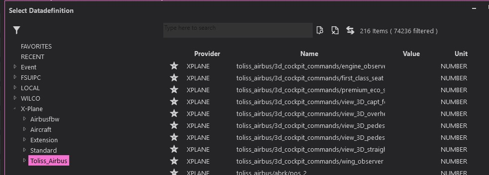

# ToLiss A340-642 Dataref / Command Feeds for Spad.neXt
---
Intergration of AirbusFBW & toliss-airbus datarefs using in switch commands for Spad.neXt (requires X-Plane license)

Output feeds are shown in Spad.neXt under X-Plane/Airbusfbw & X-Plane/Toliss_Airbus respectivly.

Variables are [0,1] unless using [toggle].

I have provided a complete feed of the respective datarefs.txt & commands.txt but if you only need a few feeds you can find them under /variables in this repo.

## Installation
---
To install the datarefs.txt & commands.txt file(s) you install them within the following root directory, ensure you x-plane client is not running as well as Spad.neXt as these will require a reload if not exited:

   
    x-plane 11\Aircraft\ToLissA346_VXpX\

There you place two files:  
+ commands.txt
+ datarefs.txt

You can then fire up x-plane 11 then into the ToLiss A340, once loaded into the plane you can then fire up Spad.neXt in which you will see the new data definitions have been added.

## Contributing
---
If i have missed any command press datarefs when new versions of ToLiss A340 comes out you can submit an issue over on the issues tab, please include a screenshot of where the button or switch is within the plane and i will try and add it if it is contained within the DataRef inputs.

## Screenshots
---
